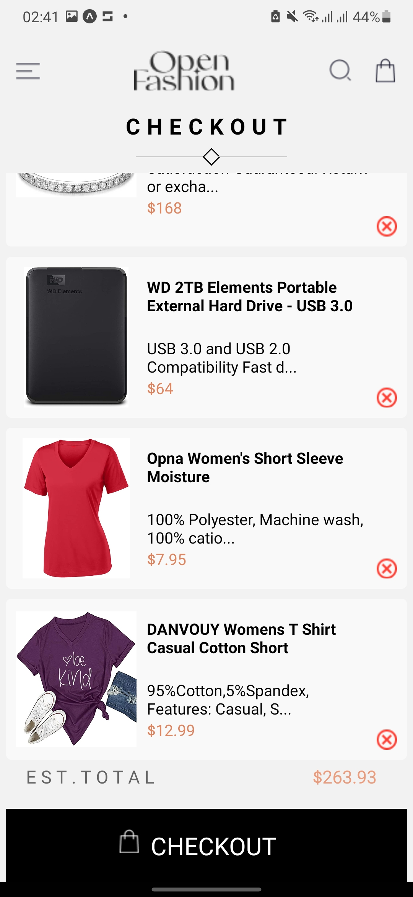

# rn-assignment7-11124894
# DCIT 202 Assignment 7
Silas Osei
11124894

Open Fashion App
The Open Fashion App fetches data from a Fakestore API and presents it on the UI. You can add products to your cart, remove products from the cart, view the total amount in the cart, see details of each product, and navigate through different screens.

Overview
The Open Fashion App is a clone of a shopping app, providing a seamless shopping experience.


Clone the repository:
```
(https://github.com/silasoseigithub/rn-assignment7-11124894)
```

2.Install dependencies

## Usage
Provide instructions on how to use your application:
- How to start the app 
```
npm start
```

Here is the revised version with improved structure and formatting:

Open Fashion App
The Open Fashion App fetches data from a Fakestore API and presents it on the UI. You can add products to your cart, remove products from the cart, view the total amount in the cart, see details of each product, and navigate through different screens.

Overview
The Open Fashion App is a clone of a shopping app, providing a seamless shopping experience.

Installation
Clone the repository:

sh
Copy code
git clone https://github.com/silasoseigithub/rn-assignment7-11124894
Navigate to the project directory:

sh
Copy code
cd rn-assignment7-11124894
Install dependencies:

sh
Copy code
npm install

Usage
Navigate through the app:
Swipe to access the drawer.
Tap on product items to view details.
Add or remove products from the cart.
View the total amount in the cart.

Technologies Used
Expo
Google Fonts
React Async Storage
React Drawer
React Navigation
For a complete list of dependencies, check the package.json file.

## Screenshots
### Home Screen


### Menu Button


### Checkout Page




### Product Details Screen


Features
Add products to cart
Remove products from cart
View product details
View cart total
View different screens

Roadmap
Add a payment method
Implement a search bar
Add a notification system
Add a user profile section
Contact Information
Name: Silas Osei
Email: #####

Contributing
Fork this repository.
Ensure your code is clear, simple, and well-documented.
Create a pull request.

License
Any reproduction of this code in either mechanical or digital means without my permission and acknowledgment is a crime and may be subject to copyright infringement.


